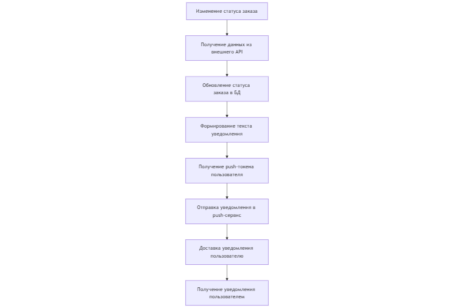

# Задача 1: описать функциональные и нефункциональные требования к процессу, включая описание бизнес-процесса и статусной модели.
## Решение:

*Функциональные требования:*
1. Система должна получать информацию о статусе заказа от внешнего сервиса.
2. Система должна обрабатывать входящие данные об изменении статуса заказа.
3. Система должна сохранять актуальный статус заказа в базе данных.
4. При изменении статуса заказа система должна формировать текст push-уведомления.
5. При изменении статуса заказа система должна отправлять push-уведомление пользователю в мобильном приложении.
6. Система должна обрабатывать ошибки при получении данных от внешнего сервиса.

*Нефункциональные требования*
1. Система должна обрабатывать обновление статуса заказа не более чем за 3 секунды.
2. Система должна отправлять push-уведомление пользователю не позднее чем через 5 секунд после изменения статуса заказа. 
3. Уведомления должны быть понятными и доставляться без задержек.
4. Система должна работать корректно при недоступности внешнего сервиса.
5. При ошибке получения данных система должна повторить запрос через 30 секунд.
6. Система должна быть доступна 99,9% времени.
7. Система должна поддерживать увеличение количества пользователей и заказов. 
8. Обмен данными с внешним сервисом должен осуществляться по защищенному соединению. 
9. Доступ к API должен быть защищем с помощью токена.
10. Система должна быть удобной и понятной для поддержки.

*Описание бизнес-процесса:*



*Статусная модель*

 

Выше представлен основной сценарий (успешный). Также могут произойти отклонения от данного сценария:
1. Статус "Отменен" может появиться на этапах "Создан", "Оплачен" или "Передан в доставку" в случае отмены заказа пользователем или системой.
2. Статус "Сбой доставки" может появиться на этапах "Передан в доставку" или "В пути" в случае невозможности завершить доставку по техническим или логистическим причинам.

# Задача 2: описать структуру API взаимодействия с внешним сервисом.
## Решение:

*Тип взаимодействия:*

Для получения информации о статусе заказа используется REST API внешнего сервиса. Система обращается к данному сервису по HTTP-протоколу и получает ответ в формате JSON. 

*Запрос:* 

```GET /api/v1/orders/{orderId}/status```

```Accept: application/json```

*Пример ответа:*
```
{
"orderId": "123",
"status": "Доставлен",
"updatedAt": "2026-02-07 15:00"
}
